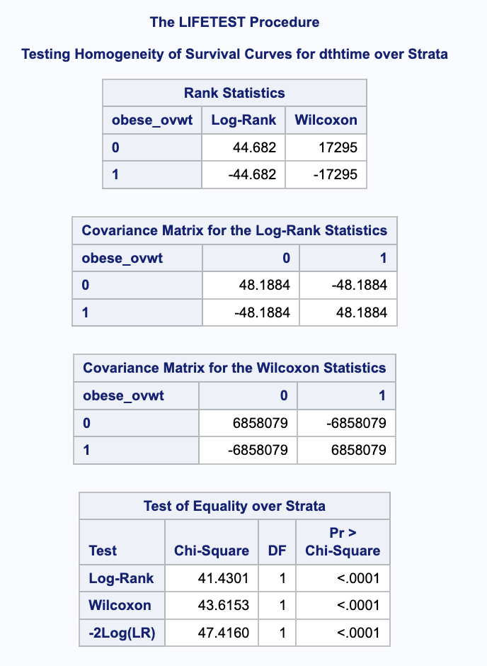
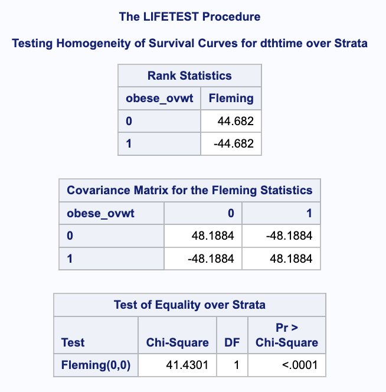
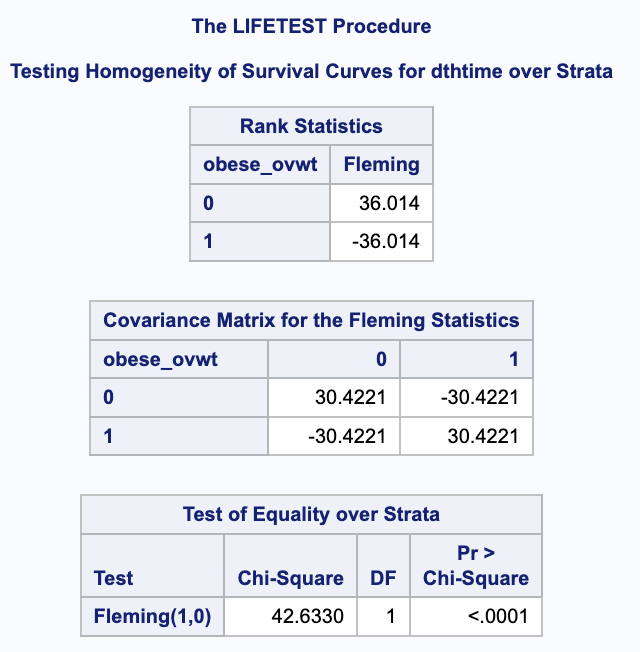
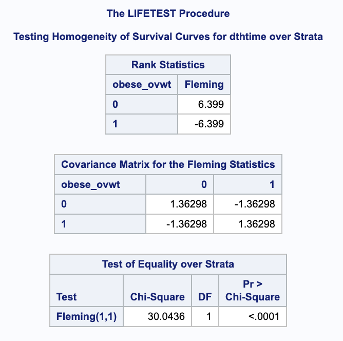
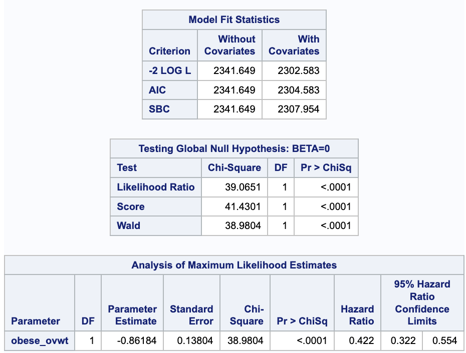
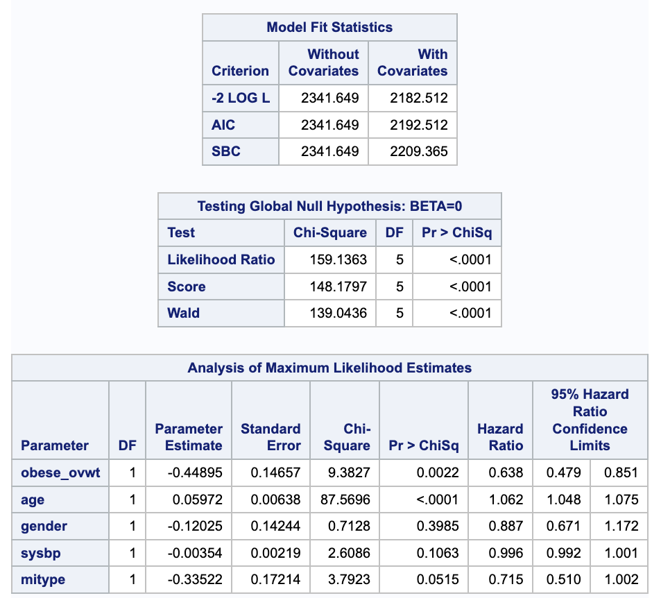
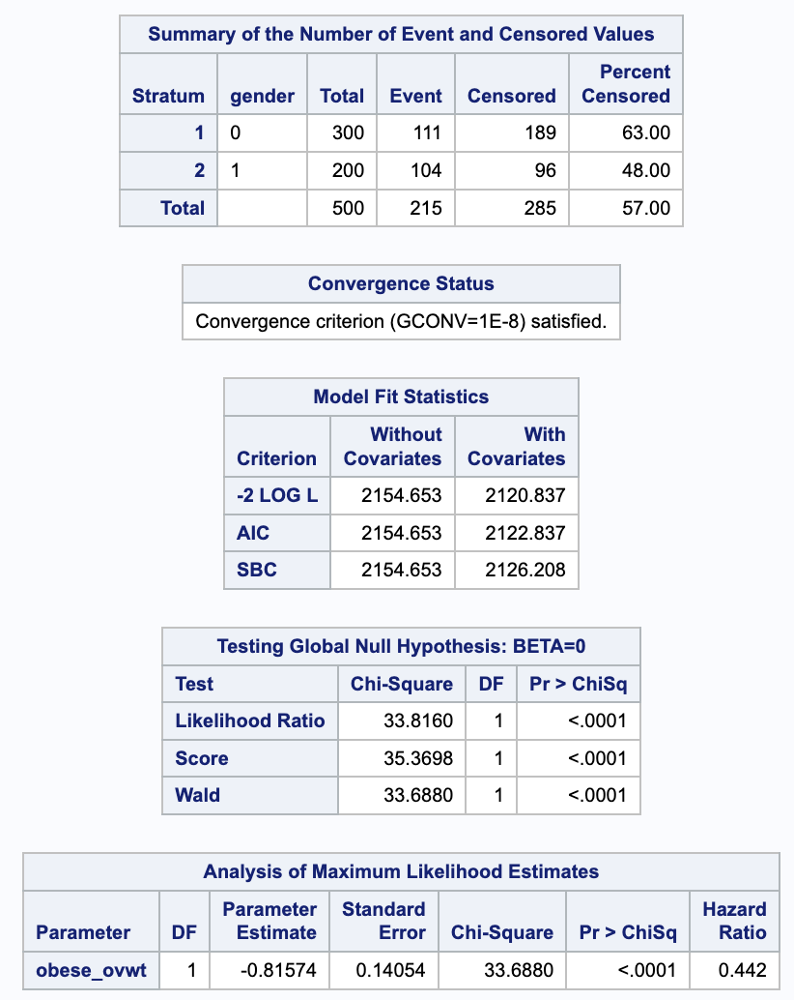
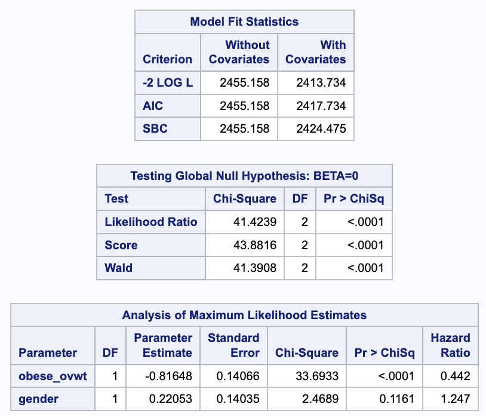
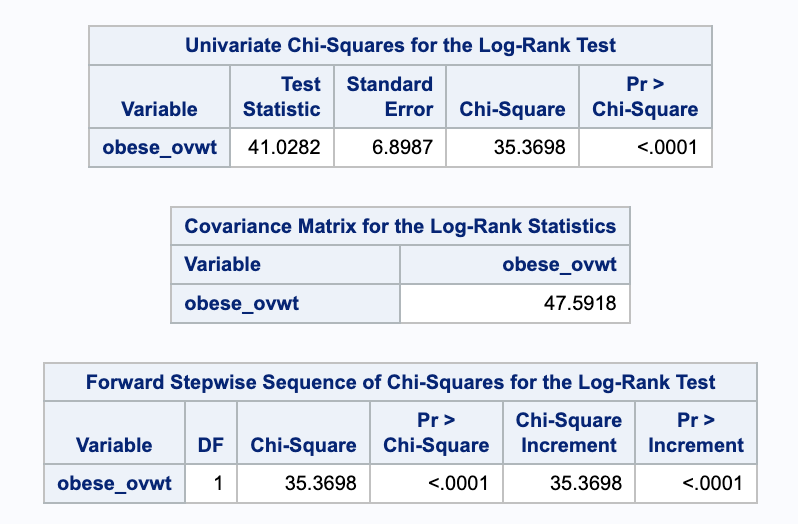
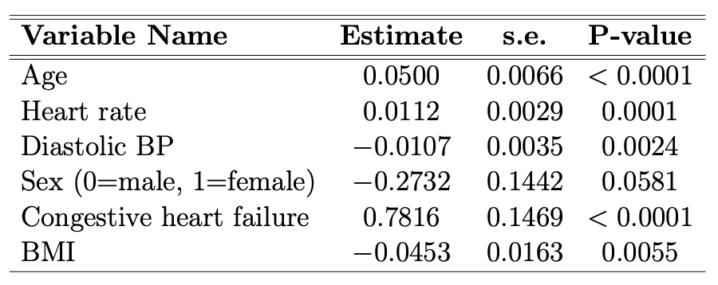

```{r setup, include=FALSE}
knitr::opts_chunk$set(echo = F, message = F, warning = F)

library(tidyverse)
library(ggplot2)
library(knitr)
library(survival)
library(ggsurvfit)
```

```{r}
# import MI data
df = haven::read_dta("./data/MIstudy-1.dta")
```

# 1. Logrank and Score Tests for MI Study
(a) Below is the plot of estimated Kaplan-Meier survival functions for the endpoint of death for those who are obese or overweight ($BMI\geq 25$) vs. those of normal weight (which we will define here as $BMI<25$):
```{r echo=F, fig.height=6, fig.width=5.8}
# fit KM curve
surv <- Surv(df$dthtime, df$dthstat)
km <- survfit(surv ~ df$obese_ovwt, df) # compare two groups (obese or overweight vs. normal weight)

# plot the KM plot
km |> 
  ggsurvfit() +
  labs(
    x = "Time (months)",
    y = "Survival Probability",
    color = "BMI Category"
  ) +
  scale_color_manual(values = c("blue", "red"), labels = c("BMI < 25", "BMI >= 25")) +
  add_censor_mark(shape = 3, size = 2) +
  add_risktable(risktable_stats = c("n.risk", "cum.censor", "cum.event"))
```

Difference in the censoring patterns between the two BMI groups:

- There is a higher frequency of censoring events throughout the study period in obese or overweight group.
- The censoring events appear to occur at similar time points for both groups, notably around 18 months, 40 months, and 67 months

```{r echo=T}
# the number of patients who are overweight or obese (BMI >= 25)
overweight_obese_count <- df |> 
  filter(bmi >= 25) |> 
  nrow()

# the percentage of overweight or obese patients out of 500
pct_overweight_obese <- (overweight_obese_count / 500) * 100
```

`r pct_overweight_obese`% of the patients out of 500 are either overweight or obese.

(b) I will implement log-rank test and Wilcoxon test using CMH approach. Below is the output from SAS.      
```{r, echo=FALSE, out.width='50%', out.height='50%'}

``` 

$\chi^2_{MH} = 41.4301$ (p-value <0.0001)  
$\chi^2_{W}=43.6153$ (p-value <0.0001)

The both tests suggest that there is an association between whether being overweight/obese and death.  
The log-rank test gives equal weight to all time points, while the Wilcoxon test gives more weight to early events. Given the KM curve, there is more differences in survival in early stage, so we can assume that Wilcoxon test would yield a larger test statistic. 

(c)    
```{r, echo=FALSE, out.width='50%', out.height='50%'}



```

p=0, q=0: $\chi^2_{FH} = 41.4301$ (p-value <0.0001)   
p=1, q=0: $\chi^2_{FH} = 42.6330$ (p-value <0.0001)   
p=1, q=1: $\chi^2_{FH} = 30.0436$ (p-value <0.0001)  

When p=0, q=0, the test statistic is equal to that of log-rank test. When p=1, q=0, the test is similar to the Peto-Prentice test and it is closer to the test statistic of Gehan's Wilcoxon test in (b). When p=1, q=1, the Fleming-Harrington test gives more weight to events happening around the median time. The smaller test statistic indicates fewer mid-term differences between two BMI groups.  
If most events happen earlier, we expect p=1, q=0 to be more powerful than log-rank test, and if most events happen around the middle of the study period, we expect p=1, q=1 to be more powerful. Fleming-Harrington may be less powerful compared to log-rank test when most of the events occur later in the follow-up period.    

(d) I will use a logistic regression model to test whether the proportions of deaths during follow-up differ for those who are over-weight/obese versus those of normal weight. 
```{r}
summary(glm(dthstat ~ obese_ovwt, df, family = binomial))
```
The result indicates that being over-weight/obese has approximately `r round((1-exp(-1.1732))*100, 2)`% lower odds of death compared to non-obese individuals when adjusting for no other variables, and this is statistically significant.  
This conclusion (being over-weight/obese have somewhat positive effect on mortality) is similar to the results of survival analysis in (b) and (c). Survival analysis may become more powerful when there are considerable number of censoring in the study subject and the data is highly skewed.

# 2. Cox Model for Myocardial Infarction Study
(a) Below is the SAS output of Cox PH model and Wald, Score, and LR tests.   
```{r, echo=FALSE, out.width='50%', out.height='50%'}

```

Given the results of MLE, over-weight/obese individuals have hazard ratio of 0.422 (p-value <0.0001). In other words, over-weight/obese individuals have a `r round((1-0.422)*100,2)`% lower risk of death compared to normal-weight individuals.  

Wald test: $\chi^2=38.9804$ (p-value <0.0001)  
Score test: $\chi^2=41.4301$ (p-value <0.0001)  
LR test: $\chi^2=39.0651$ (p-value <0.0001)  
The three test indicates that the model including covariate `obese_ovwt` is significant. The score test has a test statistic that is exactly the same as the log-rank test from 1(b), because there is only one binary covariate in this model.

(b) The adjusted Cox PH model (age, gender, systolic blood pressure, type of MI) is shown below:
```{r, echo=FALSE, out.width='50%', out.height='50%'}

```

### Summary of findings 
Unadjusted HR: `obese_ovwt` 0.422 (95% CI: 0.322-0.544)   
Adjusted HR: `obese_ovwt` 0.638 (95% CI: 0.479-0.851)  
`age` 1.062 (95% CI: 1.048-1.075)   
`gender` 0.887 (95% CI: 0.671-1.172)   
`sysbp` 0.996 (95% CI: 0.992-1.001)   
`mitype` 0.715 (95% CI: 0.510-1.002)  

The unadjusted HR of overweight/obesity for mortality was 0.422 (95% CI: 0.322-0.544), indicating a significant protective effect. Adjusting for other covariates reduces the protective effect, but the HR remains significant at 0.638 (95% CI: 0.479-0.851), suggesting that adjustment for factors such as age and blood pressure slightly reduces but does not eliminate the association.  

(c)   

i. Test for `obese_ovwt` from Cox PH model, stratifying by gender    
```{r, echo=FALSE, out.width='50%', out.height='50%'}

```

Score test statistic: $\chi^2=35.3698$ (p-value <0.001)    
HR for `obese_ovwt`: 0.442 (p-value <0.001)   

ii. Test for `obese_ovwt` from Cox PH model, controlling for gender   
```{r, echo=FALSE, out.width='50%', out.height='50%'}

```

Score test statistic: $\chi^2=43.8816$ (p-value <0.001)  
HR for `obese_ovwt`: 0.442 (p-value <0.001)    
HR for `gender`: 1.247 (p-value 0.1161)    

iii. Log-rank test (linear rank) for `obese_ovwt`, stratifying by gender  
```{r, echo=FALSE, out.width='50%', out.height='50%'}

```

Log-rank (linear rank) $\chi^2=35.3698$ (p-value <0.0001)  

Log-rank (linear rank) test statistic is equivalent to score test statistic in (i).  
In Cox PH model, by controlling for gender, the score test statistics increased from 35.3698 to 43.8816, indicating a better fit with the data. This suggests that controlling for gender has a higher power than stratifying by it.  

(d) Stratification allows the baseline hazard to vary by gender, which is beneficial when gender is a strong confounder for the outcome and the proportional hazards assumption does not hold across genders. One of the disadvantages is the potential loss of power, as seen in (c), due to the smaller size within each stratum. To further examine whether stratification is appropriate, I would suggest testing the proportional hazards assumption, such as using the Schoenfeld residual test.

# 3. Model Interpretation - Myocardial Infarction Study
```{r, echo=FALSE, out.width='50%', out.height='50%'}

```

(a) Given the coefficient estimate table, the estimated hazard for death is:  
$\lambda(t,Z)=\lambda_0(t)exp(\beta_1\cdot Age+\beta_2\cdot HR+\beta_3\cdot dBP+\beta_4\cdot Sex+\beta_5\cdot CHF+\beta_6\cdot BMI)$  
$=\lambda_0(t)exp(0.05\cdot Age+0.0112\cdot HR-0.0107\cdot dBP-0.2732\cdot Sex+0.7816\cdot CHF-0.0453\cdot BMI)$

(b) "Baseline" group is defined as a model with the following values:  
Age: `age` = 0  
Heart rate: `hr` = 0   
Diastolic BP: `diasp` = 0  
Sex: `gender` = 0 (male)  
Congestive heart failure: `chf` = 0 (no)  
BMI: `bmi` = 0  
There are no observations that fall into such a group.

(c) The estimated HR for death associated with `bmi` = 30 vs. `bmi` = 24, holding all other covariates constant:  
$HR = \frac{exp(0.05\cdot Age+0.0112\cdot HR-0.0107\cdot dBP-0.2732\cdot Sex+0.7816\cdot CHF-0.0453\times 30)}{exp(0.05\cdot Age+0.0112\cdot HR-0.0107\cdot dBP-0.2732\cdot Sex+0.7816\cdot CHF-0.0453\times 24)}$  
$=exp(0.0453\times 30-0.0453\times 24)=$ `r round(exp(-0.0452*30+0.0453*24),2)`

The 95% CI for this estimate can be obtained by calculating the following:  
$L=exp(-0.0453\times 6-1.96\times 0.0163\times 6)=$ `r round(exp(-0.0453*6-1.96*0.0163*6), 2)`  
$U=exp(-0.0453\times 6+1.96\times 0.0163\times 6)=$ `r round(exp(-0.0453*6+1.96*0.0163*6), 2)`

The estimated HR 0.76 indicates that individuals with a BMI of 30 have a 24% lower hazard of death compared to individuals with a BMI of 24, all else being equal. The 95% CI is (0.63, 0.92), suggesting that this HR estimate is statistically significant.

(d) The estimated HR of death for a subject aged 60 years vs. 50 years, holding all other covariates constant:  
$HR = \frac{exp(0.05\times 60+0.0112\cdot HR-0.0107\cdot dBP-0.2732\cdot Sex+0.7816\cdot CHF-0.0453\cdot BMI)}{exp(0.05\times 50+0.0112\cdot HR-0.0107\cdot dBP-0.2732\cdot Sex+0.7816\cdot CHF-0.0453\cdot BMI)}$  
$=exp(0.05\times 60-0.05\times 50)=$ `r round(exp(0.05*60-0.05*50),2)`

The 95% CI for this estimate can be obtained by calculating the following:  
$L=exp(0.05\times 10-1.96\times 0.0066\times 10)=$ `r round(exp(0.05*10-1.96*0.0066*10), 2)`  
$U=exp(0.05\times 10+1.96\times 0.0066\times 10)=$ `r round(exp(0.05*10+1.96*0.0066*10), 2)` 

The estimated HR 1.65 indicates that individuals aged 60 years have a 65% higher hazard of death compared to individuals aged 50 years, all else being equal. The 95% CI is (1.45, 1.88), suggesting that this HR estimate is statistically significant.

(e)

(f)

# 4. Impact of Ties on Cox Model Estimation and Testing
