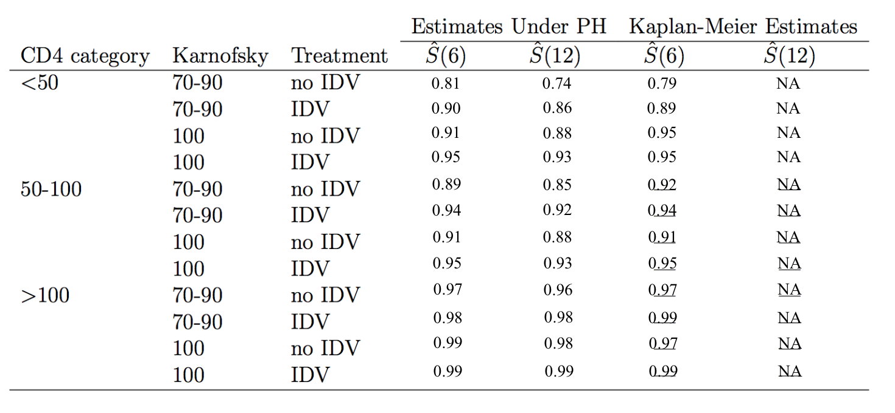

```{r setup, include=FALSE}
knitr::opts_chunk$set(echo = T, message = F, warning = F, collapse = T)

library(tidyverse)
library(ggplot2)
library(knitr)
library(survival)
library(survminer)
library(ggsurvfit)
```

```{r}
# import MI data
df = haven::read_dta("./data/actg320.dta")
```

# 1. Model Selection
Endpoint: time to AIDS progression or death (time)  
Primary variable of interest: treatment with IDV or no IDV

I will use Collett's model selection approach to decide the final model.  
First, let's fit univariate models for each covariate and identify the predictors significant at $\alpha= 0.20$.
```{r}
covariates = c("trt", "hemophil", "hemophil", "karnof", "cd4", "priorzdv", "age", 
               "female", "sqrtcd4", "cd4_50", "cd4cat", "cd4_under50", "cd450_100", 
               "cd4_squared", "ivdu", "black", "hispanic", "karnof100")
univariate = list()

# function for univariate model
for (cov in covariates) {
  formula <- as.formula(paste("Surv(time, censor) ~", cov))
  model <- coxph(formula, data = df)
  summary <- summary(model)
  p_value <- summary$coefficients[1, "Pr(>|z|)"]
  univariate[[cov]] <- p_value
}

# filter covariates with p-value <= 0.20
sig_cov <- names(univariate[univariate <= 0.20])
print(sig_cov)
```

Listed covariates meet p-value < 0.20. Now, I will move on to evaluate multivariate model with all significant univariate predictors and use backward selection to eliminate non-significant variables at level 0.10.
```{r}
# multivariate Cox model using significant univariate predictors
mult_formula <- as.formula(paste("Surv(time, censor) ~", paste(sig_cov, collapse = " + ")))
multivariate <- coxph(mult_formula, data = df)

# perform backward selection with p-value threshold of 0.10
bkwd <- step(multivariate, direction = "backward", k = qchisq(0.10, 1, lower.tail=FALSE)) # check parameter k for p-value of 0.10

summary(bkwd)
```

Next, I will perform forward selection to consider each of the non-significant variable with significance level of 0.10.
```{r}
sig_cov <- names(coef(bkwd))  # extract significant covariates from backward model

# remove variables not present in the backward model from the lower scope
fwd_formula <- as.formula(paste("Surv(time, censor) ~", paste(sig_cov, collapse = " + ")))

# Ensure upper scope includes all potential covariates
full_formula <- as.formula(paste("Surv(time, censor) ~", paste(covariates, collapse = " + ")))

# perform forward selection starting from the backward model
fwd_model <- step(
  bkwd,
  scope = list(lower = fwd_formula, upper = full_formula),
  direction = "both",
  k = qchisq(0.10, 1, lower.tail = FALSE)
)

# display the final model
summary(fwd_model)
names(coef(fwd_model))
```

Listed are the significant covariates from this process. 
Finally, I will use stepwise regression with significant level 0.10 to prune the main-effects model.
```{r}
sig_cov <- names(coef(fwd_model))
sig_cov <- setdiff(sig_cov, "trt")  # exclude treatment

# create the formula for main effects only
base_formula <- as.formula(
  paste("Surv(time, censor) ~", paste(sig_cov, collapse = " + "), "+ trt")
)

# fit the base model with main effects
base_model <- coxph(base_formula, data = df)
summary(base_model)
```

Here I will add pairwise interaction with treatment by creating interaction terms between treatment and each significant covariate.
```{r}
# interaction terms between treatment and covariates
interaction_terms <- paste("trt *", sig_cov, collapse = " + ")

# Create the formula with main effects + interactions with treatment
itrct_formula <- as.formula(
  paste("Surv(time, censor) ~", paste(sig_cov, collapse = " + "), "+ trt +", interaction_terms)
)

# Fit the model with interactions
interaction_model <- coxph(itrct_formula, data = df)
summary(interaction_model)
```

I will use likelihood ratio test to evaluate whether including the interaction tems significantly improves the model.
```{r}
# likelihood ratio test
lr_test <- anova(base_model, interaction_model, test = "LRT")
print(lr_test)
```

The result (p >0.05) indicates that adding the interaction terms does not significantly improve the model's fit ro the data. Therefore, I will cheese `base_model` and perform stepwise regression for the final pruning.
```{r}
# stepwise selection to prune the model
pruned_model <- step(
  base_model,
  direction = "backward",
  k = qchisq(0.10, 1, lower.tail = FALSE)  # Set p-value threshold of 0.10
)

summary(pruned_model)
```

All the covariates meet p-value <0.10.

```{r}
# table of -2logL and AIC for the various models I considered in the process of model selection
data.frame(
  Model = c("Base Model", "Interaction Model", "Pruned Model"),
  Minus2LogL = c(
    -2 * logLik(base_model),
    -2 * logLik(interaction_model),
    -2 * logLik(pruned_model)
  ),
  AIC = c(
    AIC(base_model),
    AIC(interaction_model),
    AIC(pruned_model)
  )
) |> kable()
```

We can confirm that the pruned model has the lowest AIC and should be used as the final model.

```{r}
# summary table of the final model
final_summary <- summary(pruned_model)

# create a data frame for parameter estimates
data.frame(
  Coefficient = final_summary$coefficients[, "coef"],
  SE = final_summary$coefficients[, "se(coef)"],
  "P-value" = final_summary$coefficients[, "Pr(>|z|)"],
  HR = exp(final_summary$coefficients[, "coef"])
) |> 
  kable()
```

Treatment with IDV is significantly associated with a reduced risk of AIDS progression or death. Patients receiving IDV experience approximately a 49% reduction in the hazard compared to those not receiving IDV, holding other variables constant. A higher Karnofsky score (better functional status) is significantly associated with a reduced risk of AIDS progression or death. For every 1-point increase in the Karnofsky score, the hazard decreases by approximately 5.4%, holding other variables constant. A higher baseline CD4 count is significantly associated with a reduced risk of AIDS progression or death. For every 1-cell increase in baseline CD4 count, the hazard decreases by approximately 1.4%, holding other variables constant. Age is also a significant predictor. Older age is associated with a slightly increased risk of AIDS progression or death, with a hazard increase of approximately 2.2% per year, holding other variables constant. Prior IV drug use appears to be associated with a reduced hazard, though the association is not statistically significant at the 0.05 level.    
The treatment effect alone (unadjusted) shows a significant reduction in the risk of AIDS progression or death. After adjusting for covariates such as Karnofsky score, CD4 count, age, and IV drug use, the treatment effect remains significant. This indicates that the effect of treatment is not heavily confounded by these variables.  


# 2. Evaluating Linearity of CD4 Effects
a. CD4 as continuous, on original scale and square root transformation
```{r}
# original scale
cd4_cont <- coxph(Surv(time, censor) ~ cd4 + age + ivdu + karnof + trt, data = df)

# square root transformation
df$sqrt_cd4 <- sqrt(df$cd4)
cd4_sqrt <- coxph(Surv(time, censor) ~ sqrt_cd4 + age + ivdu + karnof + trt, data = df)
```


b. CD4 as ordinal (with levels 1=<50, 2=50-100, and 3=> 100.)
```{r}
df$cd4_ordinal <- cut(df$cd4, breaks = c(-Inf, 50, 100, Inf), labels = c(1, 2, 3), right = FALSE)
cd4_ordinal <- coxph(Surv(time, censor) ~ cd4_ordinal + age + ivdu + karnof + trt, data = df)
```


c. CD4 as categorical (create indicators for <50 and 50-100)
```{r}
df$cd4_under50 <- ifelse(df$cd4 < 50, 1, 0)
df$cd4_50_100 <- ifelse(df$cd4 >= 50 & df$cd4 <= 100, 1, 0)
cd4_cat <- coxph(Surv(time, censor) ~ cd4_under50 + cd4_50_100 + age + ivdu + karnof + trt, data = df)
```

d. CD4 as linear and quadratic terms (cd4 and cd4^2)
```{r}
df$cd4_squared <- df$cd4^2
cd4_quad <- coxph(Surv(time, censor) ~ cd4 + cd4_squared + age + ivdu + karnof + trt, data = df)
```

```{r}
# summary table for comparison
data.frame(
  Model = c("Continuous (original)", "Square Root", "Ordinal", "Categorical", "Linear + Quadratic"),
  Minus2LogL = c(
    -2 * logLik(cd4_cont),
    -2 * logLik(cd4_sqrt),
    -2 * logLik(cd4_ordinal),
    -2 * logLik(cd4_cat),
    -2 * logLik(cd4_quad)
  ),
  AIC = c(
    AIC(cd4_cont),
    AIC(cd4_sqrt),
    AIC(cd4_ordinal),
    AIC(cd4_cat),
    AIC(cd4_quad)
  )
) |> kable()
```
The Continuous (original) model for CD4 is preferred as it provides the best prediction based on AIC and simplicity, while maintaining comparable fit to the data. The Linear + Quadratic model, while slightly more flexible, does not justify its added complexity given the small difference in fit.

# 3. Predicted Time to AIDS or Death Under PH and KM
```{r}
# define CD4 category as in part 2b
df$cd4_cat <- cut(df$cd4, breaks = c(-Inf, 50, 100, Inf), labels = c("1", "2", "3"), right = FALSE)

# define Karnofsky score category
df$karnof100 <- ifelse(df$karnof == 100, 1, 0)
```

I will fit the cox model with treatment, CD4 category, and Karnofsky score (100 vs. lower).
```{r}
cox_model <- coxph(Surv(time, censor) ~ cd4_cat + trt + karnof100, data = df)

summary(cox_model)
```

Now, let's calculate the predicted probability of remaining alive and AIDS-free for each combination of these covariates at 6 months and 1 year.
```{r}
# create a new data frame for prediction
pred_dat <- expand.grid(
  time = c(6, 12),
  censor = c(0, 1),
  cd4_cat = c("1", "2", "3"),  
  trt = c(0, 1),               
  karnof100 = c(0, 1)         
)

# predict survival probabilities
preds <- predict(cox_model, newdata = pred_dat, type = "expected", se.fit = TRUE)

# convert predicted survival probabilities
pred_dat$prob <- exp(-preds$fit) # survival probability: exp(-expected risk)
print(pred_dat)

# calculate survival estimates under KM
# fit KM survival curves stratified by CD4 category, treatment, and Karnofsky score
pred_dat <- expand.grid(
  time = c(6, 12),
  censor = c(0, 1),
  cd4_cat = c("1", "2", "3"),  
  trt = c(0, 1),               
  karnof100 = c(0, 1)         
)

km_fit <- survfit(Surv(time, censor) ~ cd4_cat + trt + karnof100, data = df)
summary(km_fit, 6)
summary(km_fit, 12)
```

The summary table is shown below. 
```{r, echo=FALSE, out.width='100%'}

```

The baseline is CD4 category <50, Karnofsky 70-90, and treatment without IDV. The table shows that subgroup with CD4 <50, Karnofsky 70-90, treatment without IDV has the highest risk of AIDS or death at 12 months. 

To calculate the 6-month survival probability for a specific group using the predicted survival of a baseline group in the Cox PH model, I will use the hazard ratios from the model. 

The survival probability for a specific group is given by:
$S(6) = S_0(6)^{\exp(X \beta)}$

Where:

- $S(6)$: Survival probability at 6 months
- $S_0(6)$: Baseline survival probability at 6 months
- $X$: Covariate vector
- $\beta$: Coefficient vector from the Cox model

```{r}
# baseline survival probability at 6 month
summary(survfit(cox_model), times = 6)$surv
```

Since subgroup with CD4 <50, Karnofsky 70-90, treatment without IDV is the baseline group, ${\exp(X \beta)}=e^0=1$. Therefore, $S(6) = 0.8058679^1\approx0.81$. This is what we have in the table. 

The KM method shows slightly lower survival probabilities at 6 months for subgroups with lower Karnofsky scores or no IDV treatment compared to PH estimates. This suggests that the proportional hazards assumption in the Cox model may overestimate survival for some groups. At 12 months, KM estimates are unavailable for many subgroups due to insufficient follow-up data, while PH estimates can extrapolate survival probabilities based on model assumptions. Both methods consistently show better survival with higher CD4 count, IDV treatment and higher Karnofsky scores.

# 4. Assessing the Proportional Hazards Assumption
a. 
b. 
c. 

# 5. Evaluating Fit of the Final Model


